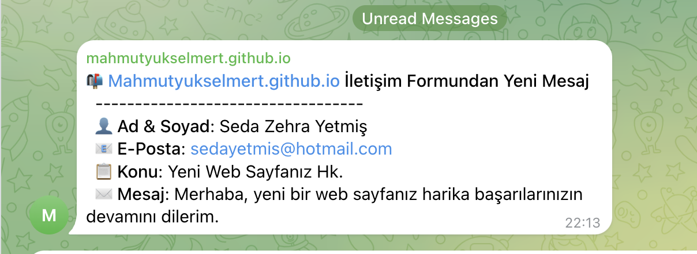

# Contact Us with Telegram on Firebase Functions

Bu proje, Firebase Functions kullanarak bir Telegram botu üzerinden iletişim formu gönderme sistemini kurmanıza yardımcı olur. Kullanıcılar, formu doldurduktan sonra veriler Telegram botu aracılığıyla belirlediğiniz bir Telegram grubuna gönderilecektir.

Sahip olduğunuz html iletişim formuna basit bir şekilde bu projeye bağlayabilirsiniz. Örnek iletişim formu için; bu https://github.com/mahmutyukselmert/mahmutyukselmert.github.io projeyi inceleyebilirsiniz.

## Örnek Ekran Görüntüsü


## Telegram Botu Oluşturma ve Konfigürasyon

1. **Telegram Botu Oluşturma**
   - Telegram uygulamasını açın.
   - Arama kısmına `@BotFather` yazın ve `BotFather`'ı seçin.
   - `/newbot` komutunu gönderin.
   - Botunuza bir isim ve kullanıcı adı verin. (Örneğin: `MyContactFormBot`)
   - Botunuz oluşturulduktan sonra, `BotFather` size bir **token** verecek. Bu token, Telegram API'siyle etkileşimde kullanacağınız kimlik doğrulama anahtarınızdır.

2. **Botu Telegram Grubuna Ekleme**
   - Telegram uygulamasında, botunuzu eklemek istediğiniz grubu açın.
   - Grup ayarlarına gidin ve **"Grup Yönetici"** kısmından **botu ekleyin**.
   - Botu ekledikten sonra, grup üyelerinin botu kullanabilmesi için yönetici hakları vermeyi unutmayın.

3. **Grubun Chat ID'sini Alma**
   https://api.telegram.org/bot**YOUR_TOKEN**/getUpdates

## Proje Konfigürasyonu

Projenin çalışabilmesi için aşağıdaki adımları takip ederek gerekli bilgileri `index.js` dosyasına girmeniz gerekmektedir.

### Adım 1: `index.js` Dosyasını Konfigüre Etme

Aşağıdaki satırlarda belirtilen yerleri doğru bilgilerle doldurduğunuzdan emin olun.

```javascript
const TELEGRAM_BOT_TOKEN = 'YOUR_BOT_TOKEN'; // Botunuzdan aldığınız token'ı buraya yapıştırın.
const CHAT_ID = 'YOUR_CHAT_ID'; // Telegram grubunun chat ID'sini buraya yazın.
const ALLOWED_ORIGIN = 'YOUR_WEBSITE_URL'; // Sadece bu URL'den gelen istekleri kabul etmek için sitenizin URL'sini buraya yazın.
```

### Firebase Install & Deployment

```shell 
npm install -g firebase-tools
```

```shell 
firebase login
```

```shell 
firebase init functions
```

```shell 
firebase deploy --only functions
```
